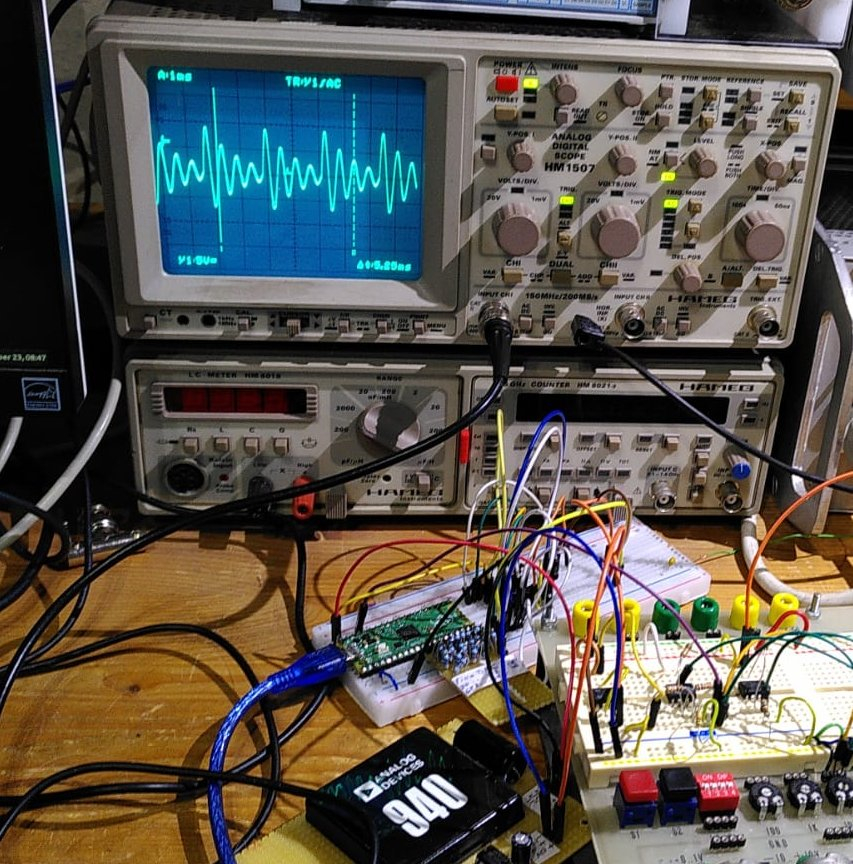

# Arbitrary Waveform Generator
Simple sine / triangle /rect / sawtooth / arbitrary (formula defined) generator with Raspi Pico ca. 1Hz ...30kHz

This started as an educational project (me learning about PIO and DMA) and ended as a quite usable AWG generator that is computer controlled.
A document describing my efforts is found here:

https://staff.ltam.lu/feljc/electronics/uPython/PIO_DDS.pdf

There is a small PC software now to control the generator:

https://github.com/jean-claudeF/ArbitraryWaveformGenerator/blob/main/awg_v.mp4

Again I find the small Pico programmed in Micropython is a very useful piece of hardware.
It has some big advantages over Arduino, for example:
- one controller can have more programs on it that can easily be exchanged or edited
- functions can be called from the exterior, via UART terminal or via Picoconnect

So, writing a rudimentary PC software was not a big deal, see Python folder.

tk_awg_04.py now includes setting frequency according to musical intervals.

