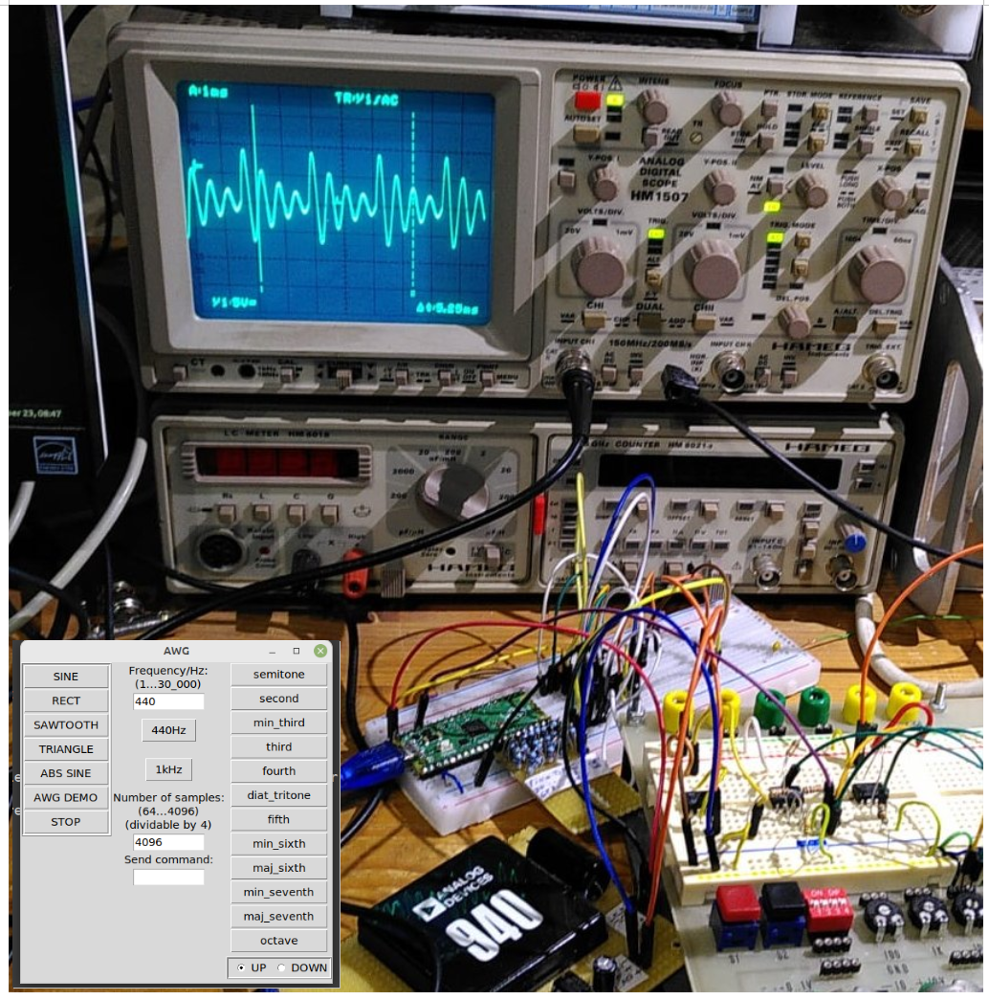
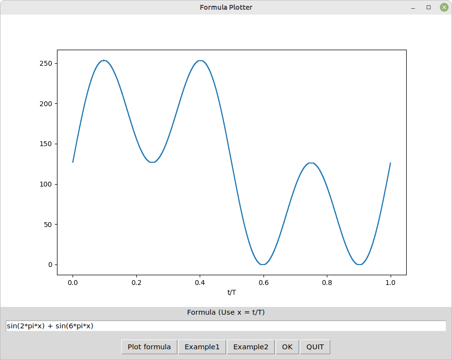

# Arbitrary Waveform Generator
Simple sine / triangle /rect / sawtooth / arbitrary (formula defined) generator with Raspi Pico ca. 1Hz ...30kHz



This started as an educational project (me learning about PIO and DMA) and ended as a quite usable AWG generator that is computer controlled.
A document describing my efforts is found here:

https://staff.ltam.lu/feljc/electronics/uPython/PIO_DDS.pdf

There is a small PC software now to control the generator:

https://github.com/jean-claudeF/ArbitraryWaveformGenerator/blob/main/awg_v.mp4

Again I find the small Pico programmed in Micropython is a very useful piece of hardware.
It has some big advantages over Arduino, for example:
- one controller can have more programs on it that can easily be exchanged or edited
- functions can be called from the exterior, via UART terminal or via Picoconnect

## Micropython

MODES:
modes = ["sine", "saw", "triangle", "rect", "demo", "abssine", "awg","awg_new", "awg_last"]

For the mode "awg" the Pico must have a file awgvalues.py that defines the curve in Python format
like this:

``` python
function = 'sin(2*pi*x) + cos(3*pi*x)'
N = 4096
values = [231, 231, 231, 231, 232, 232, 232, ...]
```

There is a Python software for the PC to easily generate and transfer this.

For an explanation of the fundamental algorithm see here:

https://staff.ltam.lu/feljc/electronics/uPython/PIO_DDS.pdf


### Some explanations to the code

#### Modes sine, saw, triangle, rect

The waveform is calculated and the buffer filled with the calculated values.

N is the number of samples


#### awg modes

- the modes awg, awg_new and awg_last essentially do the same, the different names are for compatibility with the PC software only


- For awg() and awg_new(), data are imported in Python format.
This is elegant, but leads to failure if the import is done more than once.
To avoid this, the module awgvalues is deleted if it was already in memory.

``` python
def awg():
    global N, buffer
    try:
        del sys.modules['awgvalues']
    except:
        print("Importing awgvalues.py")
        
    import awgvalues as a
    set_N(a.N)
    values = a.values
    print(a.function)
   
    for i in range(0, N):
        buffer[i] = values[i]
```        

#### Setting modes and frequency via terminal

When awg_05.py is started, a loop that asks for frequency or mode is started.

Thus the generator can be simply controlled via serial terminal.

``` python
def mainloop():
    sine()
    start(440)
    
    while(True):
        f = ask_f_and_mode()
        if not f:
            stop()
            break
        start(f) 
    stop()
```

The function ask_f_and_mode is used to input frequency or mode, or stop on empty input:

``` python
def ask_f_and_mode():
    modes = ["sine", "saw", "triangle", "rect", "demo", "abssine", "awg","awg_new", "awg_last"]
    f = FREQUENCY
    print("Input f/Hz or mode")
    print("Modes: ", modes)
    print("Empty to stop")
    s = input("f/Hz or mode: ")
    if not s:
        f = 0
        stop()
    elif s.isdigit():
        f = float(s)
    else:
        if s in modes:
            exec(s + "()")
    
    return f
```


### Formula plotter
The formula plotter allows you to enter a formula, see the graph (normalised to one period and byte values 0...255) as needed by the AWG.



Let's first have a look at some utility functions:

``` python
def calculate_y(x, n, function):
    y = empty(n, dtype=float)
    s = f"y[:] = {function}"
    exec(s)
    return y

def normalize(y):
    maxy = max(max(y), abs(min(y)))
    return y / maxy

def normalize_to_bytes(y):
    return ((y * 127) + 127).astype(int)

def calc_xy(n, function):
    x = linspace(0.0, 1.0, n)
    y = calculate_y(x, n, function)
    return x, y
    
def calc_awg(n, function):
    # returns py string s 
    # contains function = ..., N=... and y=[....] (byte values), 
    # and x, y values
    x, y = calc_xy(n, function)
    y1 = normalize(y)
    yb = normalize_to_bytes(y1)
    yv = array(yb, dtype = uint8)
    yv = yv.tolist()
    x = x.tolist()
    s = "function = '" + function + "'\n"
    s += "N = " + str(n) + "\nvalues = " + str(yv)

    return s, x, yv    
```
The main function is calc_awg(n, function).
This calculates a list of x and a list of y values for a given function, and returns a string s that can be used to write an awgvalues.py file.
The x range is fixed to 0...1, corresponding to 1 period.
There are some parts of these functions that were a little tricky (for me!) and cost me some time to get ready.
Here they are:
- In calculate_y we first create an empty numpy array of type float. This can then be used in an exec statement to put in the y values.
The trick here is to use y[:] = instead of simply putting  y = ...
- In calc_awg, The y values are first converted to integer (byte) values uint8. Then this numpy array is converted to a list. And this list is used in the string s, so it can be written to the awgvalues.py file.


